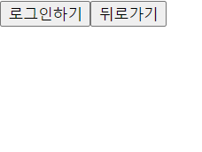

# 인스타그램 탐색 탭 카피 웹

## 소개

- 인스타그램의 탐색 탭을 참고함
- 한 피드 당 이미지를 최대 8장 까지 업로드 할 수 있음
- 업로드를 위해 이미지를 선택하면 자동으로 1:1 비율로 리사이징
- firebase storage와 realtime database의 정보를 통해 이미지를 렌더링
- 가장 최근에 업로드된 피드부터 순차적으로 렌더링
- 구글 계정을 통해 로그인 후 자신이 올린 피드들을 따로 렌더링

## 웹 사이트 화면

|            홈/로그인 홈         |
| :----------------------------: |
|     |
| |

|              로그인            |
| :---------------------------------: |
|      |

|            업로드          |
| :-------------------------------------: |
|      |
|      |
| 최대 8장까지 삽입 가능 |
| 이미지 다시 클릭 시 제거 |

|          프로필       |
| :-------------------------------: |
|      |

|          firebase       |
| :-------------------------------: |
|      |
|      |
|      |

## 기술 스택

- React
- react-router-dom
- firebase: authorization, storage, realtime database
- styled-components: 효율적이고 보기 편한 css 적용
- zustand: 전역 상태 관리 라이브러리
- pica: 이미지 사이즈 조절
  